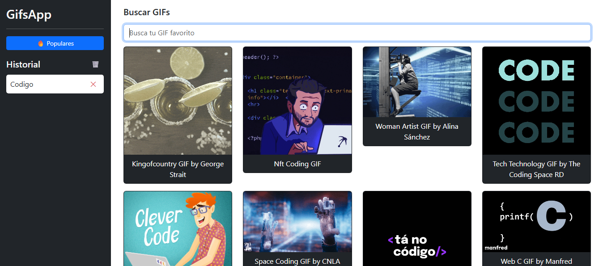

# 🎞️ Gifs App – Buscador de Gifs y Videos

Aplicación web desarrollada con Angular v17 para buscar y mostrar gifs y videos mediante la API de GIPHY. Este proyecto tiene como objetivo integrar peticiones HTTP a una API externa, manejar datos dinámicamente y presentar resultados con una interfaz simple y rápida.

---

## 📸 Vista previa del proyecto



---

## ✨ Características

- 🔍 Búsqueda dinámica de gifs y videos.
- ⚡ Resultados en tiempo real desde la API de GIPHY.
- 📱 Diseño responsive adaptado a distintos dispositivos.
- 🧹 Limpieza automática del historial.
- 🌐 Navegación fluida entre componentes.

---

## 🛠️ Tecnologías y herramientas

- 
- 
- 

---

### 🌐 API Utilizadas

| Función       | API                                         |
| ------------- | ------------------------------------------- |
| Gifs & vídeos | [GIPHY API](https://developers.giphy.com//) |

---

## 🚀 Cómo instalar y ejecutar localmente

⭣ 1. Clona el repositorio

```console
git clone https://github.com/kevinmadrid-dev/gifs-app.git
```

⭣ 2. Entra a la carpeta del repositorio

```console
cd gifs-app
```

⭣ 3. Instalar dependencias

```console
npm install
```

⭣ 4. Ejecutar en entorno de desarrollo

```console
ng serve
```

- NOTA: El proyecto se abrirá en http://localhost:4200

---

### Contacto

- GitHub: [kevinmadrid-dev](https://github.com/kevinmadrid-dev)
- LinkedIn: [kevinmadrid-dev](https://www.linkedin.com/in/kevinmadrid-dev/)

⭐ Si te gusta este proyecto, ¡dale una estrella en GitHub!
